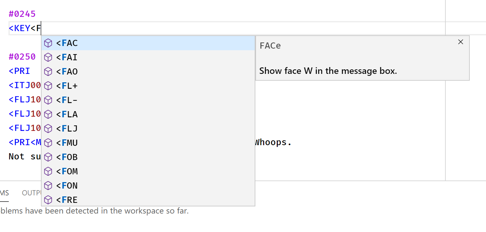
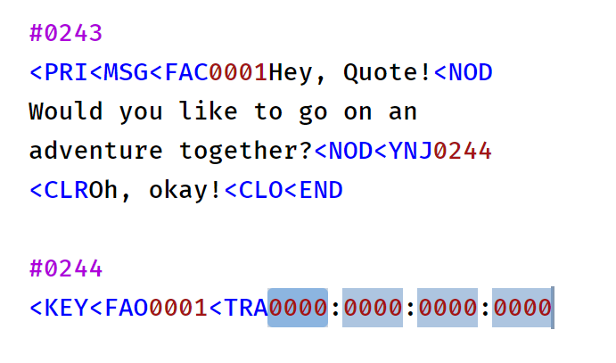
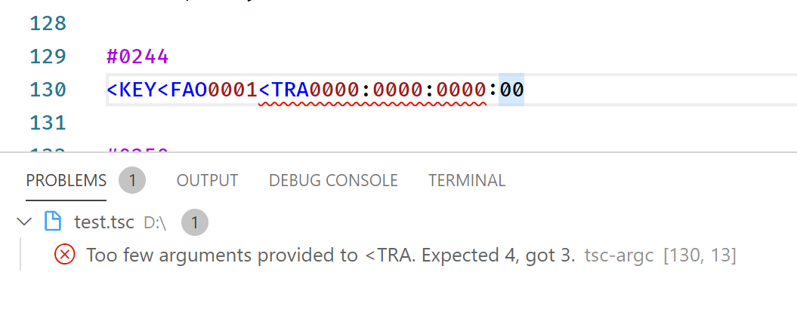
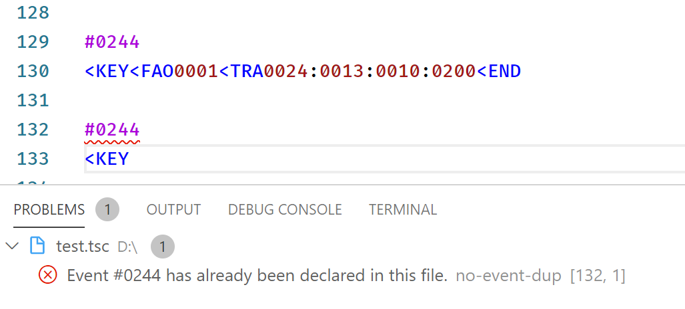

# TSC Language Tooling

This repository contains two components: a language server for the TSC format, as well as a language client for Visual Studio Code. TSC is the scripting language used in Cave Story.

Currently, both of these components are in a very early stage, so bugs may appear and some things might feel weird.

## Features

### VSCode Plugin

- Syntax highlighting


### Language Server

- Command autocompletion





- Command syntax checker



- Helpful messages for commands on hover


- Event duplication checker



- Warning on messagebox overflow


## Planned Features

- [ ] Event folding (client)
- [x] Helpful general attribute tooltips (server)
- [x] `.tscrc.json` for configurable settings (such as safe textbox length) and custom commands (such as `<MIM`)

## .tscrc.json

`.tscrc.json` is the file that powers the TSC language server. It contains definitions for TSC commands, directions, faces, maps, weapons, items, equippables, illustrations, songs, and sound effects.

A [default `.tscrc.json`](https://github.com/jozsefsallai/tsc-language-tooling/blob/master/server/src/.tscrc.json) is included in the language server and it's based on the original Cave Story game. By default, the language server will load values from the built-in file, but it's possible to use custom overwrites and custom definitions. For example, you may add the definitions of another (non-standard) command to the list of available commands or you can specify the face portraits that your game uses.

Usually, you'd want to create a `.tscrc.json` file in the root directory of your project (the directory you open in your IDE). When the language client sees this file, it will notify the language server to merge it with the default config.

Remember, you don't have to redefine everything - just whatever you want to add/overwrite. Everything (except the TSC definition fields) is optional.

### Example

<details>
<summary>View Example</summary>

```jsonc
{
  "setup": {
    "maxMessageLineLength": {
      // number, optional
      "plain": 35,

      // number, optional
      "portrait": 28
    }
  },

  "tsc": {
    // each key should be a command
    "<MIM": {
      // string
      "key": "<MIM",

      // string, same as "key"
      "label": "<MIM",

      // string, command expansion
      "detail": "MImiga Mask",

      // string, documentation (tooltip)
      "documentation": "Give mimiga mask X to player.",

      // string, template of the command
      "format": "<MIMXXXX",

      // string, the autocomplete system of your IDE will use this
      // template for insertion. Don't include the < at the beginning
      // and write each argument as a ${index:0000} pair (you can
      // write anything instead of 0000)
      "insertText": "MIM${1:0000}",

      // number, the number of arguments the command expects
      "nargs": 1,

      // array of strings, optional if the command has no arguments,
      // each argument's type
      //
      // argument types:
      //   number, direction, face, map, weapon, item, equippable,
      //   illustration, song, sfx
      // custom argument types:
      //   if the type name is preceeded by `custom:` (with the colon
      //   at the end and without backticks), the search will happen
      //   in an object from the "custom" property. For example, if
      //   the type is "custom:physics", the search will happen in the
      //   custom.physics object of .tscrc.json. More on this below.
      // the language server will provide argument-related information
      // based on this array
      "argtype": [ "number" ]
    }
  },

  // key-value pairs for each direction
  "directions": {
    "0000": "Left",
    "0001": "Up"
    /// ...
  },

  // array of strings, in order of appearance in the portrait file;
  // first value should always be "reset". Overwriting this value will
  // overwrite all default values of the "faces" array
  "faces": [
    "reset",
    "Sue",
    "Toroko"
    // ...
  ],

  // key-value pairs for each map
  // the convention for the values is "MapFilename - Map name"
  "maps": {
    "0000": "Null",
    "0001": "Pens1 - Arthur's House"
    // ...
  },

  // key-value pairs for each weapon
  // <GIT uses these values if the argument is under 1000
  "weapons": {
    "0001": "Snake",
    "0003": "Fireball"
    // ...
  },

  // key-value pairs for each item
  // 0000 is usually "reset"
  // <GIT uses these values if the argument is 1000 or more
  "items": {},

  // key-value pairs for each equippable item
  "equippables": {},

  // key-value pairs for each ending illustration
  "illustrations": {},

  // key-value pairs for each song
  "songs": {},

  // key-value pairs for each sound effect,
  "sfx": {},

  // custom argument types, similar to how the ones above work
  // (except for "faces"). For example:
  //   "custom": {
  //     "physics": {
  //       "0000": "Max Walk Speed",
  //       // ...
  //     }
  //   }
  "custom": {}
}
```

</details>

## Contribution

**1. Clone the repo:**

```sh
git clone git@github.com:jozsefsallai/tsc-language-tooling.git
```

**2. Install the dependencies:**

```sh
npm i
```

**3. Watch or compile:**

```sh
npm run watch
npm run compile
```

Don't forget to make sure that your changes pass the linter:

```sh
npm run lint
```

## License

MIT. Cave Story (Doukutsu Monogatari) is the property of Daisuke "Pixel" Amaya and Nicalis, Inc.
